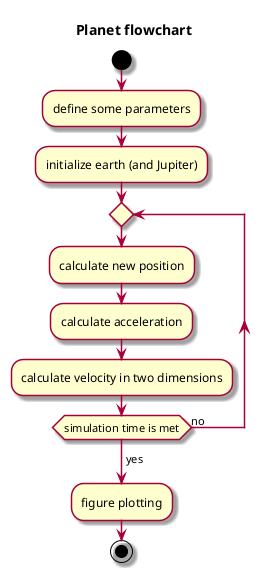

## Plan
### Background
- The climate last about 1 million years has been largely determined but the change of the eccentricity (elongation) of Earth’s orbit (One of the [Milankovitch cycles](https://en.wikipedia.org/wiki/Milankovitch_cycles)).

- The glacial cycles (daily speaking: ice ages) with a period of about 100 000 years are thought to be due to this.

  - Theory: The gravity form the other planets, especially Jupiter, causes the change of the eccentricity

- Problem: Reproduce Milankovitch cycle of eccentricity (100ka)

- Method: Use Python

  - Let’s go for functional programming

- Input: Some initial positions of the planets but no external data

  - Perhaps also user input of length of simulation

- Output: Graph of orbits and a timeseries of an eccentricity parameter

Development steps (we extend the program with iterations)

1. Earth-sun system

2. Add Jupiter

3. Make modular

4. Add more planets?


## PlantUML


## Pseudocode
```plantuml
Define constants
Define initial values
	positions
	velocity (balance of gravity and centrifugal force)
(Allocate (book) space for long vectors	plan iteration)
Iteration
	Change of positions
	Calc acc (gravity)
	Calc new velocity
Plot resulting ellipses
Calculate orbit parameters
Plot time series of parameter change
```

